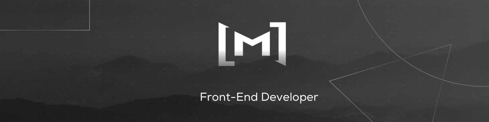

<!-- ### 👋 Hi there, I'm <a href="https://www.linkedin.com/in/mahdi-elhasra/" target="_blank">Mahdi EL Hasra</a>

### Delighted to encounter your presence here!

Passionate Front-End Web Developer adept in JavaScript, TypeScript, Python, React/Next.js, MongoDB, MySQL, and assorted technologies. Proficient in surmounting challenges and presenting innovative solutions.

### Talking about Personal Stuffs:

- 📫 How to contact me: <a href="mailto:Mahdi.elhasra@gmail.com">Mahdi.elhasra@gmail.com</a>
- 🚀 Explore my most <a href='https://jotion-x.vercel.app/' target="_blank">Recent project</a>
<!-- - 📝 <a href='https://myresume.so' target="_blank">Resume</a> -->
<!--
### Technologies & Tools:
<!--

 -->

<!-- Hi! My name is Mahdi EL Hasra 

🌍  I am a Prospective Developer based in Sale, Morocco.
 

### Skills](url) -->

<!--  &nbsp;&nbsp;&nbsp;&nbsp;&nbsp;  &nbsp;&nbsp;&nbsp;&nbsp;&nbsp;  &nbsp;&nbsp;&nbsp;&nbsp;&nbsp;  &nbsp;&nbsp;&nbsp;&nbsp;&nbsp;  -->

<!--   &nbsp;&nbsp;&nbsp;&nbsp;&nbsp;  &nbsp;&nbsp;&nbsp;&nbsp;&nbsp;
 &nbsp;&nbsp;&nbsp;&nbsp;&nbsp;  &nbsp;&nbsp;&nbsp;&nbsp;&nbsp;
 &nbsp;&nbsp;&nbsp;&nbsp;&nbsp;
 &nbsp;&nbsp;&nbsp;&nbsp;&nbsp;
 

### Socials

  

  </a>

-->
